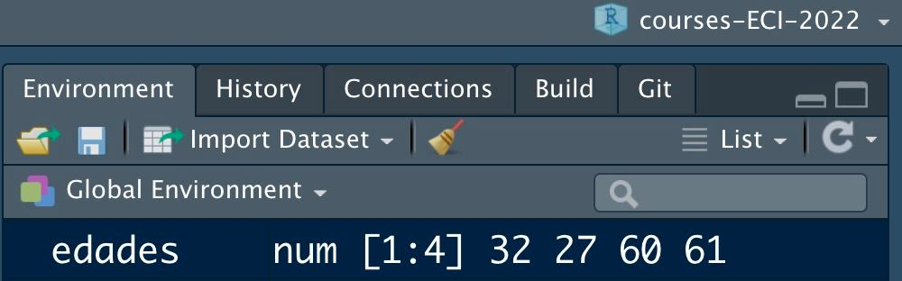

```{r echo = FALSE}
library(knitr)

# Color text
colorize <- function(x, color) {
  
  if (knitr::is_latex_output()) {
    
    sprintf("\\textcolor{%s}{%s}", color, x)
    
  } else if (knitr::is_html_output()) {
    
    sprintf("<span style='color: %s;'>%s</span>", color, x)
    
  } else { x }
}
```

# Vectores {#vectores}

:::: {.blackbox data-latex=""}

Scripts usados:

* [**script03.R**](https://github.com/dadosdelaplace/courses-ECI-2022/blob/main/scripts/script03.R): vectores.  Ver en <https://github.com/dadosdelaplace/courses-ECI-2022/blob/main/scripts/script03.R>

::::

Hemos visto como poder almacenar elementos individuales: la edad de una persona, su estado civil con una variable lógica, su nombre, su fecha de nacimiento... ¿Y si en lugar de querer almacenar un solo elemento, por ejemplo `edad <- 32`, tenemos una <mark>**colección de elementos**</mark> (las edades de toda nuestra familia, por ejemplo)?

En este capítulo vamos a ver un clásico de cualquier lenguaje de programación: los <mark>**vectores o arrays**</mark>, que no son más que una <mark>**concatenación de elementos del mismo tipo**</mark>. De hecho un número individual (por ejemplo, `x <- 1`) es en realidad un vector de longitud uno (un solo elemento).

Un vector es lo que solemos representar como $\overrightarrow{x} = \left[1, 2, 3 \right]$ en matemáticas, pero no te preocupes si nunca has visto esta forma de representarlos. Vamos a empezar de cero.


## Vectores numéricos

La forma más sencilla de **crear un vector** en `R` es con el comando `c()` (de **concatenar elementos**), y basta con introducir sus elementos entre paréntesis, y separados por comas. Voy a crear el **vector con las 4 edades de los miembros de mi familia**.

```{r}
edades <- c(32, 27, 60, 61)
edades
```

Como ves ahora en el <mark>**environment**</mark> (entorno, **arriba a la derecha**) tenemos una colección de elementos guardada, con cuatro en concreto, guardados en una misma variable `edades`.

```{r vectores-environment, echo = FALSE, fig.align = 'center',  include = identical(knitr:::pandoc_to(), 'html'), fig.cap = 'Vector en el enviroment', out.width = '70%'}

```

La <mark>**longitud de un vector**</mark> se puede calcular con el comando `length()` (nos devolverá el número de elementos de la variable que le pasemos como argumento).

```{r}
length(edades)
```

Además podemos <mark>**concatenar a su vez vectores**</mark> (uno tras otro): vamos a concatenar el vector `edades` consigo mismo, y añadiéndole al final un 8.

```{r}
c(edades, edades, 8)
```

Esta última concatenación lo que nos ha dado son, primero, los cuatro elementos que ya teníamos en `edades`, después de nuevo los cuatro elementos, y por último un 8.


## Secuencias numéricas con un patrón

Muchas veces nos gustaría <mark>**crear vectores de una forma mucho más rápida**</mark>. Supongamos que queremos un vector de identificadores de números, desde el 1 hasta el 21. Si construyéramos el vector como antes, tendríamos que ejecutar el comando `c(1, 2, 3, 4, 5, ...)` hasta llegar al número 21. ¿Un poco largo, no?

Hay un atajo: el comando `seq()` nos permite crear una <mark>**secuencia desde un elemento inicial hasta un elemento final**</mark>, avanzando de uno en uno.

```{r}
seq(1, 21) # secuencia desde 1 hasta 21 de uno en uno
```

Es importante que no perdamos el foco: <mark>**programar es similar a escribir en un idioma**</mark>, por lo que si hay algo que se puede decir de una forma más limpia y que se entienda mejor, ¿por qué no usarlo? Siempre que queramos definir secuencias entre dos números naturales (por ejemplo, entre `1` y un valor `n`), cuya distancia entre elementos consecutivos sea uno, el comando `1:n` nos devuelve lo mismo que la orden `seq(1, n)`. Además, si el elemento inicial es mayor que el final, `R` entenderá solo que la secuencia la queremos **decreciente**.

```{r}
n <- 21
1:n # secuencia desde 1 hasta n (21) de uno en uno
n:1 # secuencia decreciente
```


&nbsp;

También podemos definir **otro tipo de distancia entre dos elementos consecutivos** (distancia conocida como <mark>**paso de discretización**</mark>), por ejemplo de 0.5 en 0.5, o de 1.7 en 1.7

```{r}
seq(1, 10, by = 0.5) # secuencia desde 1 a 10 de 0.5 en 0.5
seq(1, 21, by = 1.7) # secuencia desde 1 a 21 de 1.7 en 1.7
```

Otras veces nos interesará definir una secuencia entre un valor inicial y un valor final, pero nos dará igual la distancia entre cada elemento: solo nos importa que tenga un <mark>**número concreto de elementos**</mark> (y que sea `R` el que decida la distancia entre elementos consecutivos para conseguirlo).

```{r}
seq(1, 50, l = 11) # secuencia desde 1 a 50 de longitud 11
seq(1, 50, l = 8) # secuencia desde 1 a 50 de longitud 8
```

&nbsp;

Otro atajo que podemos usar para definir secuencias de números con un patrón es definir <mark>**vectores de elementos repetidos**</mark>, por ejemplo un vector lleno de ceros. La función `rep()` nos permite repetir un elemento un número fijado de veces.

```{r}
rep(0, 7) # vector de 7 ceros
```

No solo podemos repetir un número sino que podemos **repetir vectores enteros**.

```{r}
rep(c(0, 1, 2), 4) # repetimos el vector c(0, 1, 2) 4 veces
```

Esa repetición además podemos definirla también de forma **intercalada**: en lugar de repetir `c(0, 1, 2)` cuatro veces seguidas, queremos cuatro 0, después cuatro 1, y después cuatro 2.

```{r}
rep(c(0, 1, 2), each = 4) # cuatro 0, luego cuatro 1, luego cuatro 2
```


## Vectores de caracteres (texto)

Un error común es asociar el concepto de vectores solo a números: un <mark>**vector es una colección o concatenación de elementos del mismo tipo**</mark> pero no tienen porque ser necesariamente números. Vamos a crear una frase de ejemplo, un vector de 4 elementos de tipo texto (en `R` se llaman `char`): `"Mi"`, `"nombre"`, `"es"` `"Javier"`.

Como antes, las variables de tipo `char` o `character` van entre comillas dobles, ya que es un <mark>**cadena de texto**</mark>.

```{r}
mi_nombre <- c("Mi", "nombre", "es", "Javier")
mi_nombre
```

Ya tenemos nuestro primer vector de texto de longitud 4. Cuando usamos la función `paste()` con variables diferentes, usábamos `sep = ...` para decidir el caracter con el que pegamos dichas cadenas texto. Cuando la función `paste()` la aplicamos a un vector de caracteres, decidiremos que **caracter queremos que vaya entre palabra con el argumento `collapse =`**.


```{r}
paste(mi_nombre, collapse = "") # todo junto
paste(mi_nombre, collapse = " ") # separados por un espacio
paste(mi_nombre, collapse = ".") # separados por un punto .
paste0(mi_nombre) # todo junto sin nada separando
```

Ahora que sabemos lo que es un vector de números, por ejemplo el vector `1:7` (el conjunto de naturales desde el 1 hasta el 7), podemos definir cadenas de texto que compartan por ejemplo un prefijo (`persona_1`, `persona_2`, ...)

```{r}
paste0("persona", 1:7) # a la palabra «persona» le pegamos los números del 1 al 7
paste("persona", 1:7, sep = "_") # separado por una barra baja
```

De igual manera podemos hacer uso del ya conocido paquete `{glue}`, combinando cadenas de texto y vectores numéricos, obteniendo vectores de frases.


```{r}
library(glue)
edad <- 10:13 # edades
glue("La edad es de {edad} años")

# Otra forma sin definir variables a priori
glue("La edad es de {10:13} años")
```

¿Y si queremos <mark>**pasar todo a mayúscula**</mark> o <mark>**todo a minúscula**</mark>? ¿Y si queremos <mark>**sustituir un caracter**</mark> (por ejemplo, `.`) por otro en todos los elementos? 

`R` también nos proporciona algunas funciones muy sencillas (del paquete `{base}`) de usar para dichas tareas. Aquí un ejemplo de algunas de ellas.

```{r}
texto <- c("Hola.", "qué", "ase?", "todo", "bien.", "y yo",
           "que", "ME", "ALEGRO")
toupper(texto) # todo a mayúscula
tolower(texto) # todo a minúscula
```

El paquete `{base}` también nos permite <mark>**buscar y reemplazar patrones**</mark> concretos en cadenas de texto (por ejemplo, sustituir toda letra «o» por el caracter «*»), con la función `gsub()`.

```{r}
gsub("o", "*", texto) # toda "o" en el texto será sustituida por *
```

&nbsp;


## Vectores lógicos (TRUE/FALSE)

Antes hemos comentado que las variables lógicas suelen aparecer como resultado de comparaciones de elementos. Por ejemplo, imaginemos ahora que definimos un vector de números `x <- c(1.5, -1, 2, 4, 3, -4)`. ¿Qué numeros de `x` son menores que 2? Basta con que ejecutemos la orden `x < 2`, que nos devolverá `TRUE/FALSE` en cada hueco, en función de si cumple (`TRUE`) o no (`FALSE`) la condición pedida.

```{r}
x <- c(1.5, -1, 2, 4, 3, -4)
x < 2
```

El primer, segundo y sexto elemento del vector son los únicos elementos (estrictamente) menores que `2`, de ahí que en el primer, segundo y sexto elemento aparezca un `TRUE` y en el resto un `FALSE`. Es **importante** recordar que al **evaluar una condición lógica sobre un vector** de longitud `n`, la **salida sigue siendo un vector** de longitud `n` pero con valores lógicos.

Dicha condición lógica puede hacerse con otros operadores como `<=`, `>` o `>=`. 

```{r}
x <= 2
x > 2
x >= 2
x == 2
x != 2
```

&nbsp;


Al igual que antes, las **condiciones pueden ser combinadas**. Por ejemplo, vamos a calcular qué elementos del vector `c(1.5, -1, 2, 4, 3, -4)` sean menores que 3 y además mayores que 0.

```{r}
x <- c(1.5, -1, 2, 4, 3, -4)
x < 3 & x > 0 # Solo los que cumplen ambas condiciones
```

De la misma manera podemos comprobar los elementos menores que 2 o mayores que 3 (basta con se que cumple alguna de las condiciones)
```{r}
x < 2 | x > 3 # Los cumplen al menos una de ellas
```


## Datos ausentes: NA y NaN {#ausentes}

La vida no siempre es perfecta así que en muchas ocasiones nos encontraremos con lo que llamamos en estadística un <mark>**dato ausente o _missing value_**</mark>, un **valor que no tenemos en nuestra variable**, y un ejemplo práctico lo tenemos con los datos de vacunación de covid del Ministerio de Sanidad. Cada día se publicaba un PDF con los datos de vacunación PERO...no se publicabann datos los fines de semana: en dichas fechas hay datos que no tenemos, y en `R` se representan por `NA` (significa _not available_).

### NA: not available

Vamos a crear un **vector de números con datos ausentes** con la orden `x <- c(1, NA, 3, NA, NA, 5, 6)`: el vector tendrá longitud 7 pero en el segundo, cuarto y quinto elemento tendremos datos faltantes, un lugar que no tenemos relleno (pero que no eliminamos).

```{r}
x <- c(1, NA, 3, NA, NA, 5, 6) # Vector numérico con datos faltante
length(x) # longitud del vector
x
``` 


¿Puedes aventurar <mark>**qué sucede cuando multiplicamos ese vector por una constante**</mark> (por 2, por ejemplo)?

```{r}
2 * x # operación aritmética con un vector con NA
``` 

Un dato que no tenemos, multiplicado por 2, sigue siendo un dato ausente. Es muy importante para evitar resultados erróneos que entendamos que un <mark>**dato ausente no computa en una operación aritmética**</mark>, es un **hueco vacío**. Si hacemos la suma del vector, estamos sumando números más datos ausentes, por lo que el resultado final será también un dato ausente. Si tenemos algún dato ausente en nuestro vector, la suma final está a su vez ausente, ¡no podemos saber cuánto vale!

```{r}
1 + NA + 3
``` 

&nbsp;


Una manera de <mark>**localizar que elementos están ausentes**</mark> en nuestrps vectores es con la función `is.na()`, una función que nos devuelve un vector de valores lógico: `TRUE` si el elemento está ausente y `FALSE` si no lo está.

```{r}
is.na(x) # TRUE si está ausente (NA), FALSE si no lo está.
``` 

Dichos **datos ausentes se pueden eliminar** con la función `na.omit()` (aunque a veces lo que nos interesa es que no sea ausente, introduciendo el punto medio entre su valor anterior y su valor posterior, por ejemplo).

```{r}
na.omit(x)
``` 

### NaN: not a number

Hay un **tipo de dato**, como <mark>**resultado de operaciones no permitidas o cuyo resultado es indeterminado**</mark>, que en `R` lo veremos como `NaN`: _not a number_, un resultado fruto de una indeterminación, como por ejemplo la operación `0/0` (cuyo límite no está definido). Importante saber que también existe una forma de denotar al infinito como `Inf`, siendo el resultado de algunas operaciones como `1/0`.

```{r}
1/0
0/0
``` 

De la misma manera que podemos localizar valores `NA`, tenemos a nuestra disposición las funciones `is.infinte()` y `is.nan()` para detectar que elementos de nuestro vector son `Inf` o `NaN`, respectivamente.

```{r}
x <- c(1, NA, 3, 4, Inf, 6, 7, Inf, NaN, NA)
is.na(x)
is.nan(x)
is.infinite(x)
``` 


## Consejos


**`r colorize("CONSEJOS", "#20935E")`**

&nbsp;

**`r colorize("Expresiones regulares", "#20935E")`**

Dentro del entorno de paquetes `{tidyverse}`, el paquete `{stringr}` permite un manejo más complejo de cadenas de texo (como el uso de expresiones regulares).

```{r stringr2, echo = FALSE, fig.cap = "Paquete stringr para manejar cadenas de texto más complejas"}
knitr::include_graphics("./img/stringr.png")
```

&nbsp;


## 📝 Ejercicios

(haz click en las flechas para ver soluciones)

<details>
  <summary>📝<strong>Ejercicio 1</strong>: modifica el código  para crear un vector de nombre `vector_num` que contenga los números 1, 5 y -7.
  
```{r eval = FALSE}
# Vector de números
vector_num <- c(1)
vector_num
```
</summary>
  
<!-- toc -->
- Solución:

```{r}
# Vector de números
vector_num <- c(1, 5, -7)
vector_num
```

<!-- tocstop -->
</details>

&nbsp;

<details>
  <summary>📝<strong>Ejercicio 2</strong>: define un vector que contenga los números 1, 10, -1 y 2, y guárdalo en una variable llamada `vector_num`. </summary>
  
<!-- toc -->
- Solución:

```{r}
# Vector de números
vector_num <- c(1, 10, -1, 2)
vector_num
```

<!-- tocstop -->
</details>

&nbsp;

<details>
  <summary>📝<strong>Ejercicio 3</strong>: obtén la longitud del vector anterior `vector_num`. </summary>
  
<!-- toc -->
- Solución:

```{r}
# Longitud del vector
length(vector_num)
```

<!-- tocstop -->
</details>

&nbsp;


<details>
  <summary>📝<strong>Ejercicio 4</strong>: crea un vector con las palabras "Hola", "me", "llamo" (y tu nombre y apellidos), y pega luego sus elementos de forma que la frase esté correctamente escrita en castellano. Tras hacerlo, añade "y tengo 30 años". </summary>
  
<!-- toc -->
- Solución:

```{r}
# Definiendo el vector
vector_char <- c("Hola", "me", "llamo", "Javier",
                 "Álvarez", "Liébana")

# Pegamos
frase <- paste(vector_char, collapse = " ")
frase

# Añadimos frase
glue("{frase} y tengo 30 años.")

# Otra forma
paste0(frase, " y tengo 30 años.")

# Otra forma
paste(frase, "y tengo 30 años.")
```

<!-- tocstop -->
</details>

&nbsp;


<details>
  <summary>📝<strong>Ejercicio 5</strong>: el código inferior crea una secuencia de números, que empieza en `-1`, que acaba en `32`, y que va saltando de 2 en 2. Modíficalo para que haga el salto de 3 en 3 y guárdalo en una variable llamada `secuencia`
```{r eval = FALSE}
seq(-1, 32, by = 2)
```
</summary>
  
<!-- toc -->
- Solución:

```{r}
secuencia <- seq(-1, 32, by = 3)
secuencia
length(secuencia) # longitud de la secuencia
```

<!-- tocstop -->
</details>

&nbsp;


<details>
  <summary>📝<strong>Ejercicio 6</strong>: crea una secuencia de números, que empiece en `-1`, que acabe en `32`, y que tenga longitud 12. </summary>
  
<!-- toc -->
- Solución:

```{r}
secuencia <- seq(-1, 32, l = 12)
secuencia
length(secuencia) # longitud de la secuencia
```

<!-- tocstop -->
</details>

&nbsp;


<details>
  <summary>📝<strong>Ejercicio 7</strong>: crea una secuencia que empiece en 1 y recorra todos los naturales hasta el 10. Después crea otra secuencia de longitud 7 que todos los números sean `3`.  </summary>
  
<!-- toc -->
- Solución:

```{r}
1:10
rep(3, 7) # secuencia repetida
```

<!-- tocstop -->
</details>

&nbsp;


<details>
  <summary>📝<strong>Ejercicio 8</strong>: crea una secuencia que repita 5 veces el patrón `1, 2, 3`. Después crea otra que repita dicho patrón pero de forma intercalada, con 5 veces `1`, después 5 veces `2` y después 5 veces `3`.</summary>
  
<!-- toc -->
- Solución:

```{r}
rep(c(1, 2, 3), 5) # repetimos patrón (1, 2, 3) 5 veces
rep(c(1, 2, 3), each = 5) # repetimos patrón alternado
```

<!-- tocstop -->
</details>

&nbsp;


<details>
  <summary>📝<strong>Ejercicio 9</strong>: crea un vector con las edades de cuatro conocidos o familiares. Tras ello, determina cuáles de ellos tienen menos de 20 años, 30 años o más, menos de 40 años y más de 65 años.</summary>
  
<!-- toc -->
- Solución:

```{r}
edades <- c(27, 32, 60, 61) # en mi caso, por ejemplo
edades < 20 # menos de 20 años
edades >= 30 # 30 años o más
edades < 40 # menos de 40 años
edades > 65 # más de 65 años
```

<!-- tocstop -->
</details>


