```{r echo = FALSE}
library(knitr)

# Color text
colorize <- function(x, color) {
  
  if (knitr::is_latex_output()) {
    
    sprintf("\\textcolor{%s}{%s}", color, x)
    
  } else if (knitr::is_html_output()) {
    
    sprintf("<span style='color: %s;'>%s</span>", color, x)
    
  } else { x }
}
```

# Contando los datos: rmarkdown {#rmarkdown}

:::: {.blackbox data-latex=""}

Scripts usados:

* [**primer_rmarkdown.Rmd**](https://github.com/dadosdelaplace/courses-ECI-2022/blob/main/scripts/primer_rmarkdown.Rmd): importar/exportar datos.  Ver en <https://github.com/dadosdelaplace/courses-ECI-2022/blob/main/scripts/primer_rmarkdown.Rmd>

* [**segundo_rmarkdown.Rmd**](https://github.com/dadosdelaplace/courses-ECI-2022/blob/main/scripts/segundo_rmarkdown.Rmd): importar/exportar datos.  Ver en <https://github.com/dadosdelaplace/courses-ECI-2022/blob/main/scripts/segundo_rmarkdown.Rmd>

::::

Si se tuvieran que destacar una lista **fortalezas** de `R` frente a `Python`, creo que dos estarían en los primeros puestos. La primera sería las opciones de visualización y procesamiento de datos (y su sencillez). Y la segunda, para mí, es sin duda sus <mark>**opciones para generar informes**</mark>, incluso <mark>**libros, webs, apuntes y hasta diapositivas**</mark> (tienes algunos de los paquetes en la lista de recursos). Y la base de todos ellos es el paquete `{rmarkdown}`.

```{r eval = FALSE}
install.packages("rmarkdown")
```

<mark>**¿Cuál es la ventaja de generarlos desde `{rmarkdown}`?**</mark>

La más obvia es que, al hacerlo desde `RStudio`, puedes generar un informe o una presentación de unos datos sin salirte del entorno de programación en el que estás trabajando: <mark>**analizar los datos, resumirlos y comunicarlos desde el mismo entorno de trabajo**</mark>. La segunda ventaja es que nos va a permitir <mark>**integrar fácilmente código `R`**</mark>, de forma que no solo podremos integrar las salidas de nuestro trabajo sino también el código con el que lo hemos generado.

## ¿Qué es R Markdown?

De forma resumida, `R Markdown` es una herramienta que nos permite crear de forma sencilla documentos (este manual que estás leyendo está generado integramente con dicha herramienta) combinando:

* <mark>**Markdown**</mark>: creado en 2004 por John Gruber, y de uso libro, es un «lenguaje» que nos permite <mark>**crear contenido de una manera sencilla de escribir**</mark>, y que en todo momento mantenga un diseño legible, permitiendo la inclusión sencilla de <mark>**párrafos, negritas, cursivas**</mark>, etc, con algunas de las ventajas de un HTML pero sin necesidad de saber programar en él. Si acostumbras a escribir en wordpress, blogs u otras plataformas, seguramente hayas escrito de esta forma (sin saberlo quizás).
* <mark>**Latex**</mark>: herramienta (lenguaje en realidad) para escribir <mark>**notación matemática**</mark> como $x^2$ o $\sqrt{x}$. Si escribes notación similar en editores de texto, seguramente sin saberlo estés usando ya latex. Esto nos permitirá profundizar aún más en el contenido que mostremos.
* <mark>**Código y salidas de R**</mark>: podremos no solo mostrar el paso final sino el código que has ido realizando, con cajitas de código como has podido ir comprobando a lo largo de este manual.
* <mark>**Imágenes**</mark>
* <mark>**Estilos**</mark> (css, js, etc)


Y lo mejor: todo esto se podrá hacer solo con código `R` y algún extra a tener en cuenta, produciendo <mark>**material reproducible**</mark> por el resto de la comunidad. Vamos a <mark>**crear nuestro primer informe**</mark>.

## Creando nuestro primer informe

```{r echo = FALSE, fig.align = 'center',  include = identical(knitr:::pandoc_to(), 'html'), fig.cap = 'Creando el primer fichero .rmd', out.width = '40%'}
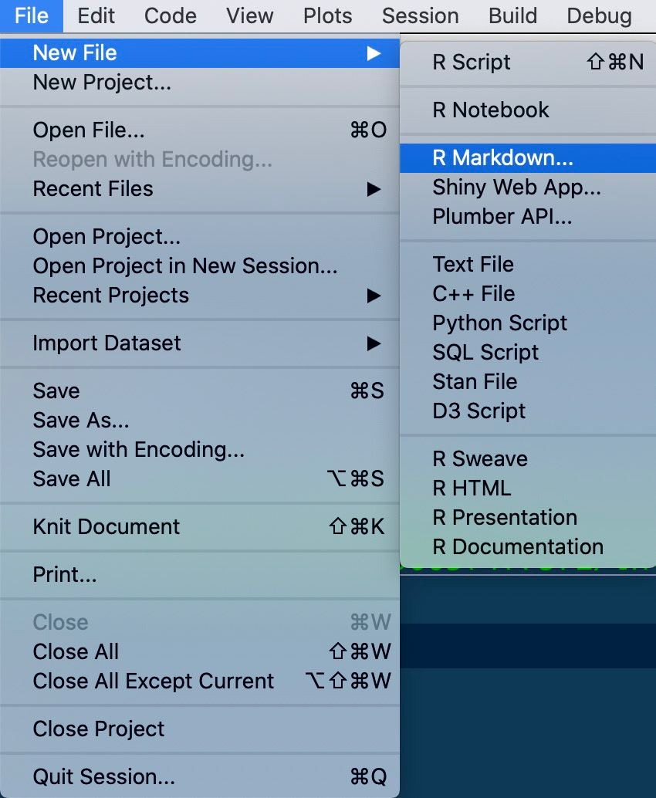
```

En la imagen anterior tienes el menú para crear el primero fichero con extensión `.rmd` (la extensión de los archivos `R Markdown`). Tras hacer click en el botón `File << New File << R Markdown`, nos aparecerá el **siguiente menú**.

```{r echo = FALSE, fig.align = 'center',  include = identical(knitr:::pandoc_to(), 'html'), fig.cap = 'Creando el primer fichero .rmd', out.width = '50%'}
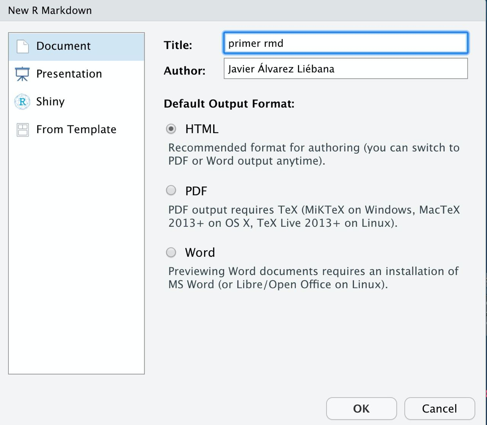
```

Como ves nos varias opciones de <mark>**formatos de salida**</mark>:

* <mark>**.pdf**</mark>
* <mark>**.html**</mark> (documento dinámico, permite la interacción con el usuario, como una «página web»)
* <mark>**.doc**</mark> (nada recomendable)

De momento <mark>**dejaremos marcado el formato HTML**</mark> que viene por defecto, y escribiremos el título de nuestro documento. Tras ello tendremos <mark>**nuestro archivo .Rmd**</mark> (fíjate arriba que ya no es un script `.R` como los que hemos abierto hasta ahora)

```{r echo = FALSE, fig.align = 'center',  include = identical(knitr:::pandoc_to(), 'html'), fig.cap = 'Creando el primer fichero .rmd', out.width = '50%'}

```

Un fichero `.Rmd` se <mark>**divide básicamente en tres partes**</mark>

1. La cabecera (eso que tienes al inicio entre `---`)
2. Texto (que podremos mejorar con **negritas** (escrito como `**negritas**`, con doble astérisco al inicio y final), **cursivas** (`_cursivas_`, con barra baja al inicio y final) o destacar nombres de funciones o variables de `R` (con ``R``). Recuerda que puedes añadir ecuaciones como $x^2$ (he escrito `$x^2$`, la ecuación entre dólares).
3. Código `R`.

### Cabecera YAML

La <mark>**cabecera**</mark> están en formato `YAML`, y contiene los metadatos del documento: título, autor, fecha, estilos (si los tuviésemos), etc. Para probar, vamos a cambiar la cabecera que nos ha generado por defecto de la siguiente forma:

* `Title`: "Probando Probando"
* `author`: "Señor X"
* `date`: "11/7/2014"
* `output`: `html_document` (le indicamos el <mark>**formato de salida**</mark>, en este caso un documento `HTML`)

```{r eval = FALSE}
---
title: "Probando Probando"
author: "Señor X"
date: "11/7/2014"
output: html_document
---
```

Tras tunear nuestra cabecera **borraremos todo lo que viene después** para empezar desde cero.

```{r echo = FALSE, fig.align = 'center',  include = identical(knitr:::pandoc_to(), 'html'), fig.cap = 'Fichero .Rmd vacío, solo con la cabecera', out.width = '65%'}
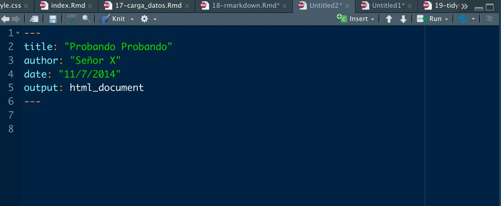
```

### Texto

Solo hay una <mark>**cosa importante a tener en cuenta**</mark> en este entorno `R Markdown`: salvo que indiquemos lo contrario, todo lo que vamos a <mark>**escribir en el documento es texto**</mark>. No código `R`. Texto plano que podremos mejorar un poco con algun detalle, pero texto.

Vamos a empezar nuestro documento escribiendo por ejemplo la siguiente frase

> Este material ha sido diseñado como complemento y recursos de apoyo al curso de la Escuela de Invierno de la UCM titulado «Analizando datos, visualizando información, contando historias», celebrado presencialmente del 31 de enero al 4 de febrero de 2022 (16:00 a 21:00 horas, de lunes a viernes).

Una vez que hemos escrito el textos vamos a <mark>**guardar el archivo `.Rmd`**</mark> haciendo click en el botón Guardar (yo he llamado al archivo `primer_rmarkdown.Rmd`). Tras guardar el documento, <mark>**tejeremos**</mark> nuestro documento haciendo click en el <mark>**botón Knit**</mark>.

```{r echo = FALSE, fig.align = 'center',  include = identical(knitr:::pandoc_to(), 'html'), fig.cap = 'Primer informe html', out.width = '70%'}
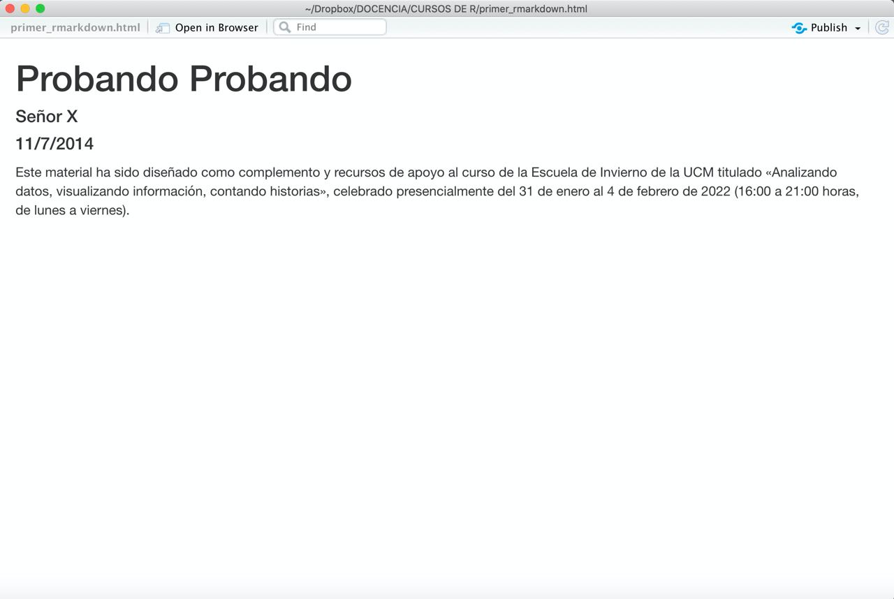
```

Al «tejer» el archivo se nos habrá **generado** (seguramente en una ventana al margen) un  <mark>**archivo `.html`**</mark>, que podemos incluso **abrir en nuestro navegador** si hacemos click en `Open in Browser`. <mark>**Hemos creado nuestro primer informe**</mark>, obviamente vacío de momento. Vamos a mejorar un poco el texto haciendo lo siguiente:

* Vamos a añadir <mark>**negrita**</mark> a la frase `curso de la Escuela de Invierno de la UCM` (poniendo `**` al inicio y al final).

* Vamos añadir <mark>**cursiva**</mark> a la palabra `material` (poniendo `_` al inicio y al final).

* Vamos añadir un <mark>**enlace**</mark>, <https://www.ucm.es/eci//cursoecic02-pre>, asociándolo al título `«Analizando datos, visualizando información, contando historias»`. Para ello el título lo ponemos entre corchetes y justo detrás el enlace entre paréntesis `[«Analizando datos, visualizando información, contando historias»](https://www.ucm.es/eci//cursoecic02-pre)`

```{r echo = FALSE, fig.align = 'center',  include = identical(knitr:::pandoc_to(), 'html'), fig.cap = 'Tuneando nuestro primer informe html', out.width = '70%'}
knitr::include_graphics("img/rmd_2.jpg")
```

Tras hacerlo volvemos a clickar en `Knit` para tejer el informe y obtendremos la siguiente salida.

```{r echo = FALSE, fig.align = 'center',  include = identical(knitr:::pandoc_to(), 'html'), fig.cap = 'Salida del informe html', out.width = '70%'}
knitr::include_graphics("img/html_rmd_2.jpg")
```

Tenemos palabras en cursiva, en negrita, y ahora el título del curso es un vínculo a una web a la que podemos hacer click. 

### Chunks: código R

Para <mark>**añadir código `R`**</mark> debemos crear nuestras <mark>**cajas de código llamadas _chunks_**</mark>: altos en el camino en nuestro texto _markdown_ donde podremos incluir código. Para incluir uno deberá de ir encabezado de la siguiente forma.

```{r echo = FALSE, fig.align = 'center',  include = identical(knitr:::pandoc_to(), 'html'), fig.cap = 'Encabezado/final del chunk', out.width = '70%'}
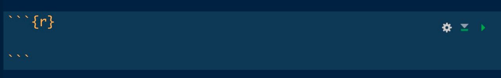
```

Dentro de dicha cajita (que tiene ahora otro color en el documento) escribiremos <mark>**código `R`**</mark>, como lo veníamos haciendo hasta ahora. Vamos por ejemplo a definir dos variables y su suma de la siguiente manera, escribiendo dicho código en nuestro `.Rmd` (dentro de ese _chunk_)

```{r}
# Código R
x <- 1
y <- 2
x + y
``` 

```{r echo = FALSE, fig.align = 'center',  include = identical(knitr:::pandoc_to(), 'html'), fig.cap = 'Primer chunk', out.width = '70%'}
knitr::include_graphics("img/rmd_3.jpg")
```

Como ves dentro de esos _chunks_ puedes **comentar código** como siempre con `#` (ahora veremos que hace `#` fuera de esas cajas de código). Tras hacerlo tejemos de nuevo y obtenemos ahora un documento que tiene una caja de código y su salida, en este caso `x + y`.

```{r echo = FALSE, fig.align = 'center',  include = identical(knitr:::pandoc_to(), 'html'), fig.cap = 'Salida del html con el primer chunk', out.width = '70%'}
knitr::include_graphics("img/html_rmd_3.jpg")
```

Somos capaces de escribir en un mismo documento texto con cierto formato, código `R` y la salida del resultado, permitiéndonos generar informes (ya veremos como incluir gráficas). De hecho, lo más práctico para <mark>**tomar apuntes de `R`**</mark> es ir anotando lo aprendido en un archivo `.Rmd`, permitiéndonos incluir explicaciones a nuestros códigos y salidas.

Los _chunk_ de código pueden tener un <mark>**nombre o etiqueta**</mark>, de forma que podamos referenciarlos de nuevo para no repetir código. Si la etiqueta es por ejemplo `chunk-1` (no se pueden poner espacios, preferiblemente solo letras y guiones), se añadirá como se muestra en la imagen inferior.

```{r echo = FALSE, fig.align = 'center',  include = identical(knitr:::pandoc_to(), 'html'), fig.cap = 'Etiquetando un chunk y reciclándolo', out.width = '70%'}
knitr::include_graphics("img/chunk_repe_tag.jpg")
```

Así queda nuestra salida: con un _chunk_ que hemos escrito y otro que no hemos tenido que escribir ya que hemos usado la etiqueta del que ya teníamos escrito.

```{r echo = FALSE, fig.align = 'center',  include = identical(knitr:::pandoc_to(), 'html'), fig.cap = 'Salida tras etiquetar un chunk y reciclándolo', out.width = '70%'}
knitr::include_graphics("img/html_tag_chunk.jpg")
```

### Organizando el documento

Con todo incluido en el documento podemos <mark>**dividirlo en secciones y subsecciones**</mark>. Para ello usaremos la sintaxis de _markdown_, poniendo almohadillas: una `#` para secciones, `##` para subsecciones, `###` para subsubsecciones, etc. Por ejemplo, vamos a

* Hacer una **sección principal** que sea `# Primer informe`
* Tras ello añadiremos la parte de texto.
* Creamos una subsección que se titule `## Chunks de código` donde incluiremos los dos _chunks_ que tenemos hasta ahora.

```{r echo = FALSE, fig.align = 'center',  include = identical(knitr:::pandoc_to(), 'html'), fig.cap = 'Secciones en el archivo .rmd', out.width = '70%'}
knitr::include_graphics("img/secciones_rmd.jpg")
```

De esta forma podemos <mark>**organizar nuestro documento en secciones y subsecciones**</mark>.

```{r echo = FALSE, fig.align = 'center',  include = identical(knitr:::pandoc_to(), 'html'), fig.cap = 'Secciones en la salida', out.width = '70%'}
knitr::include_graphics("img/secciones_rmd.jpg")
```

Además podemos incluir tras el título (y entre llaves `{}`) etiquetas (con la almohadilla `{#etiqueta}`) para luego referenciar dichas secciones en el documento. Vamos a etiqueta `# Primer informe {#seccion-1}` y  `## Chunks de código {#chunks}`. Añadiremos una nueva sección donde haremos las referencias a dichas secciones como `[Sección](#seccion-1)` y `[Subsección](#chunks)`.

```{r echo = FALSE, fig.align = 'center',  include = identical(knitr:::pandoc_to(), 'html'), fig.cap = 'Referencias a secciones y subsecciones', out.width = '70%'}
knitr::include_graphics("img/ref_rmd.jpg")
```

También podemos organizar nuestro código creando listas, usando `*` como ítems.


```{r echo = FALSE, fig.align = 'center',  include = identical(knitr:::pandoc_to(), 'html'), fig.cap = 'Creando ítems en el rmd', out.width = '70%'}
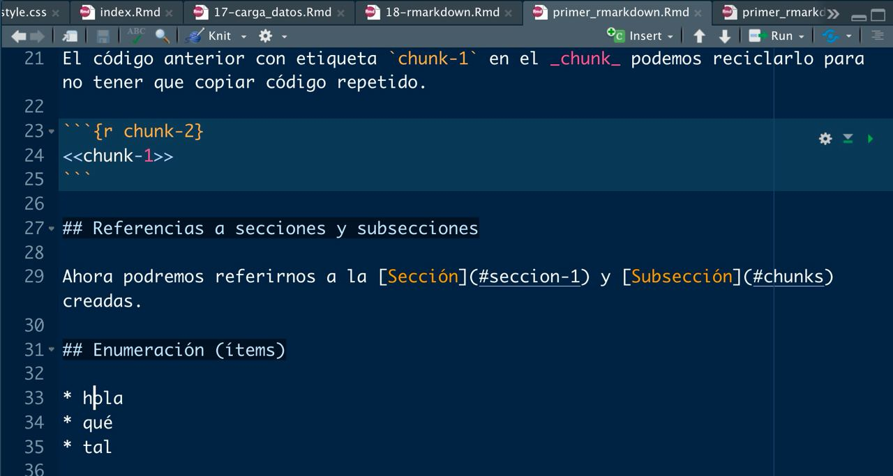
```

```{r echo = FALSE, fig.align = 'center',  include = identical(knitr:::pandoc_to(), 'html'), fig.cap = 'Salida tras crear ítems', out.width = '70%'}
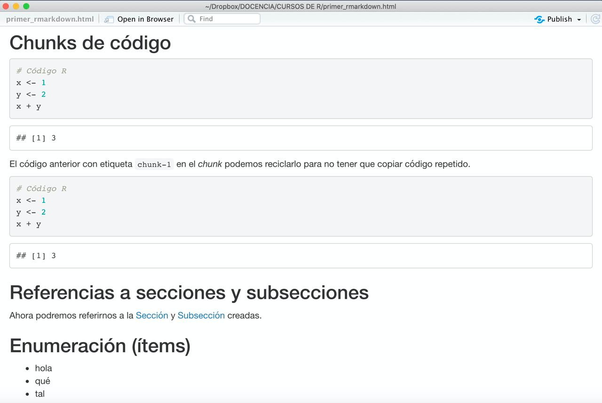
```

### Personalizando los chunks

No sé si te has fijado que <mark>**en cada chunk aparece una botón de _play_**</mark>: pulsándolo podemos tener la ejecución y salida de cada chunk en nuestro `.Rmd`, sin tener que esperar a «tejer» (con `Knit`) todo el documento para **ver lo que vamos ejecutando**.

```{r echo = FALSE, fig.align = 'center',  include = identical(knitr:::pandoc_to(), 'html'), fig.cap = 'Ejecutar chunk a chunk', out.width = '70%'}
knitr::include_graphics("img/play_chunk.jpg")
```

```{r echo = FALSE, fig.align = 'center',  include = identical(knitr:::pandoc_to(), 'html'), fig.cap = 'Chunk ejecutado', out.width = '70%'}
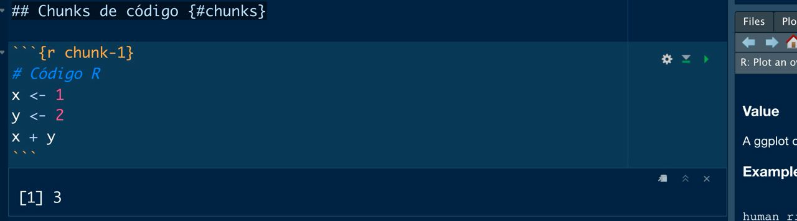
```

Además podemos <mark>**incluir código `R`**</mark> dentro de la línea de texto. Por ejemplo, podemos definir una variable `r x <- 3` para luego mostarla como `r x` (en lugar de mostrar el texto `x` ejecuta el código `R` mostrando la variable).


```{r echo = FALSE, fig.align = 'center',  include = identical(knitr:::pandoc_to(), 'html'), fig.cap = 'Código inline', out.width = '70%'}
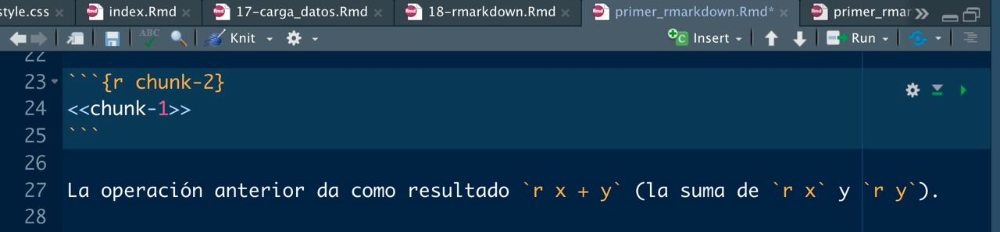
```

```{r echo = FALSE, fig.align = 'center',  include = identical(knitr:::pandoc_to(), 'html'), fig.cap = 'Salida del código inline', out.width = '70%'}
knitr::include_graphics("img/codigo_inline_html.jpg")
```

&nbsp;

Los _chunk_ podemos <mark>**personalizarlo con algunas opciones**</mark>, pasándolos como argumentos dentro de las llaves `{r etiqueta, ...}`.

* `include = FALSE`: se <mark>**ejecuta el código pero no se muestra ni código ni resultados**</mark> en la salida final (pero lo que se ejecuta puede ser usado en otros _chunks_ futuros).

* `echo = FALSE`: se <mark>**ejecuta el código y se muestra el resultado pero no el código**</mark> en la salida final. 

* `eval = FALSE`: se <mark>**muestra pero no se ejecuta el código**</mark> en la salida final. 

* `message = FALSE`: se <mark>**ejecuta el código pero no se muestran los mensajes**</mark> de salida que tendríamos en consola (en caso de existir).

* `warning = FALSE`: se <mark>**ejecuta el código pero no se muestran los warning**</mark> que tendríamos en consola (en caso de existir).

* `error = TRUE`: se <mark>**ejecuta el código pero permite ejecutar el código con errores mostrando los mensajes de error**</mark> que tendríamos en consola (en caso de existir).

Puedes ver las diferentes salidas en el archivo [primer_rmarkdown.Rmd](https://github.com/dadosdelaplace/courses-ECI-2022/blob/main/scripts/primer_rmarkdown.Rmd) en <https://github.com/dadosdelaplace/courses-ECI-2022/blob/main/scripts/primer_rmarkdown.Rmd>.

&nbsp;

Estas opciones podemos aplicarlas _chunk_ a _chunk_ o fijar los <mark>**parámetros de forma global**</mark> con `knitr::opts_chunk$set()` (dentro de un _chunk_), pasándole como argumentos dichas opciones (por ejemplo, `knitr::opts_chunk$set(echo = FALSE)`).


### Variables y ecuaciones

Por último en este primer documento vamos a añadir una subsección `## Variables y ecuaciones` donde añadiremos un _chunk_ asignando la suma `x + y` a una variable `z`, escribiendo antes en texto el nombre de la variable (`z`) y la fórmula (`$z = x + y$`).

```{r echo = FALSE, fig.align = 'center',  include = identical(knitr:::pandoc_to(), 'html'), fig.cap = 'Variables y ecuaciones', out.width = '70%'}
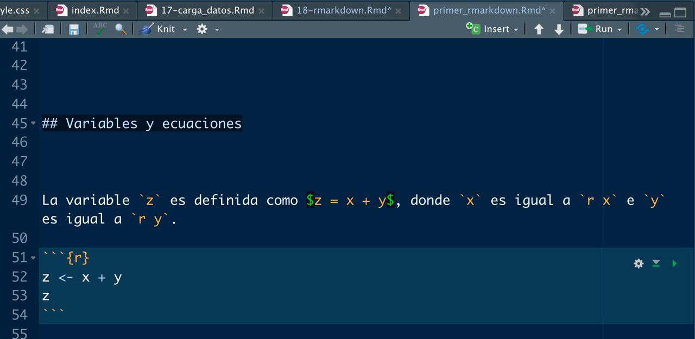
```

```{r echo = FALSE, fig.align = 'center',  include = identical(knitr:::pandoc_to(), 'html'), fig.cap = 'Salida', out.width = '70%'}
knitr::include_graphics("img/variables_html.jpg")
```


## Segundo rmarkdown

Visto como hacer un rmarkdown sencillo, vamos a aprender algunas formas de personalizarlo.

### Personalizando la cabecera

Una primera personalización en la cabecera puede ser <mark>**automatizar la fecha**</mark>, indicándole que sea la fecha del momento en el que se genere el informe con `Sys.Date()`

```{r}
Sys.Date()
format(Sys.time(), '%d de %B de %Y')
```

El código `R` podemos introducirlo en la cabecera entre las comillas.

```{r echo = FALSE, fig.align = 'center',  include = identical(knitr:::pandoc_to(), 'html'), fig.cap = 'Personalizando cabecera', out.width = '70%'}
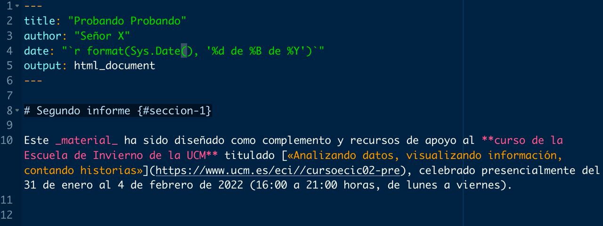
```

También podemos indicarle en la cabecera que <mark>**añadamos un índice**</mark> (toc, por sus siglas en inglés) al documento con `toc: true`.


```{r echo = FALSE, fig.align = 'center',  include = identical(knitr:::pandoc_to(), 'html'), fig.cap = 'Índice', out.width = '70%'}
knitr::include_graphics("img/toc_cabecera.jpg")
```

```{r echo = FALSE, fig.align = 'center',  include = identical(knitr:::pandoc_to(), 'html'), fig.cap = 'Índice', out.width = '70%'}
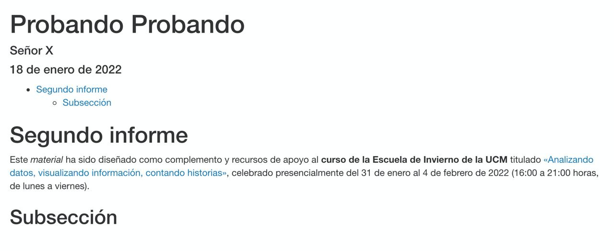
```

Además con `toc_depth:` podemos indicarle la profundidad de ese índice (hasta donde queremos que indexe, si subsecciones, subsubsecciones, etc), y `number_sections: true` nos hará que las secciones se numeren.

```{r echo = FALSE, fig.align = 'center',  include = identical(knitr:::pandoc_to(), 'html'), fig.cap = 'Numeración de secciones', out.width = '70%'}
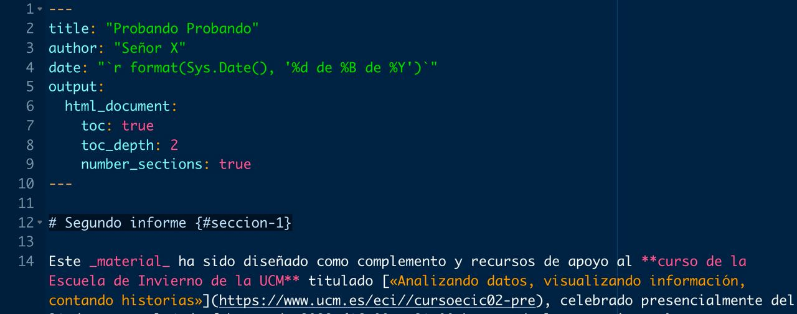
```

```{r echo = FALSE, fig.align = 'center',  include = identical(knitr:::pandoc_to(), 'html'), fig.cap = 'Numeración de secciones', out.width = '70%'}
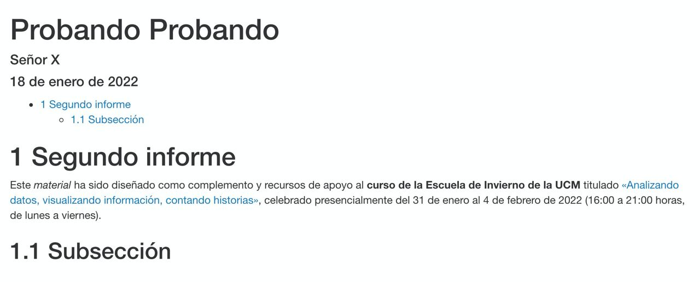
```
    

### Estilos

Al inicio del documento podemos incluir estilos .css (o incluir un archivo externo). Puedes ver la opciones en el archivo [segundo_rmarkdown.Rmd](https://github.com/dadosdelaplace/courses-ECI-2022/blob/main/scripts/segundo_rmarkdown.Rmd) en <https://github.com/dadosdelaplace/courses-ECI-2022/blob/main/scripts/segundo_rmarkdown.Rmd>.

```{r eval = FALSE}
<style>
#TOC {
  color: #708090;
  font-family: Calibri;
  font-size: 16px; 
  border-color: #708090;
}
#header {
  color: #F08080;
  background-color: #F5F5F5;
  opacity: 0.6;
  font-family: Calibri;
  font-size: 20px;
}
body {
  color: #708090;
  font-family: Calibri;
  background-color: #F5F5F5;
}
pre {
  color: #708090;
  background-color: #F8F8FF;
}
h1.title {
  color: #F08080;
  background-color: #F5F5F5;
  opacity: 0.6;
  font-family: Calibri;
  font-size: 20px;
}
h4.author {
  color: #708090;
  font-family: Calibri;
  background-color: #F5F5F5;
}
h4.date {
  color: #708090;  
  font-family: Calibri;
  background-color: #F5F5F5;
}
</style>
```


### Mostrando imágenes

Por último, con `knitr::include_graphics()` podremos <mark>**incluir imágenes**</mark>, bien que tengamos en nuestro local, o bien a través de la ruta web de la imagen. Con `out.width` podremos modular el tamaño que queremos que ocupe la imagen, con `fig.align = 'center'` la centramos y con `fig.cap = 'Ejemplo de imagen'` ponemos un pie de foto

```{r echo = FALSE, fig.align = 'center',  include = identical(knitr:::pandoc_to(), 'html'), fig.cap = 'Incluir imagen', out.width = '70%'}
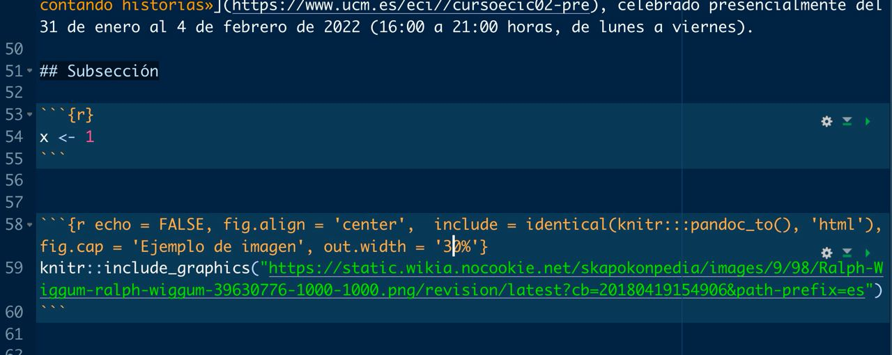
```
    

```{r echo = FALSE, fig.align = 'center',  include = identical(knitr:::pandoc_to(), 'html'), fig.cap = 'Incluir imagen', out.width = '60%'}
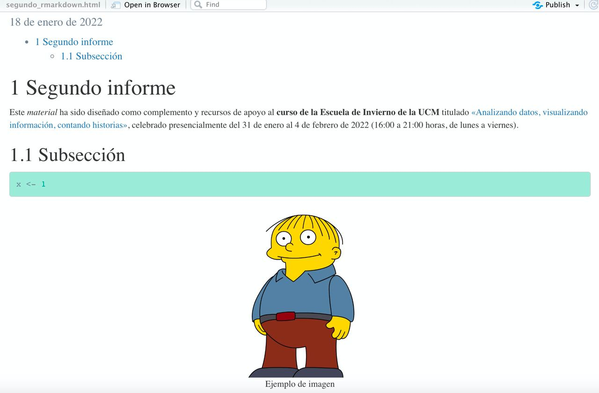
```
    


