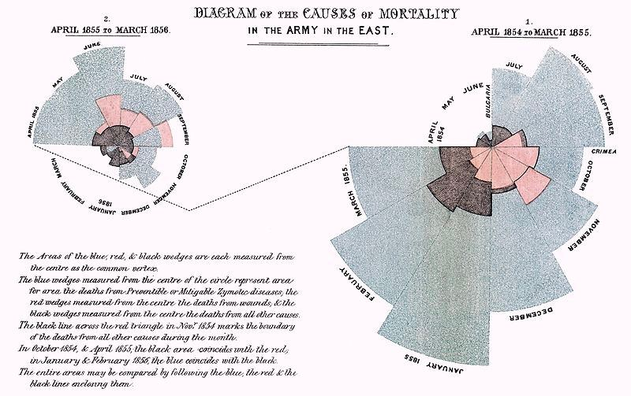

```{r echo = FALSE}
library(knitr)

# Color text
colorize <- function(x, color) {
  
  if (knitr::is_latex_output()) {
    
    sprintf("\\textcolor{%s}{%s}", color, x)
    
  } else if (knitr::is_html_output()) {
    
    sprintf("<span style='color: %s;'>%s</span>", color, x)
    
  } else { x }
}
```

# Profundizando en ggplot2 {#ggplot2_plus}


```{r}
library(tidyverse)
```


## Personalizando el tema


### Datos

En est ocasión vamos a usar los <mark>**datos de Netflix**</mark> proporcionados por Paula Casado en [El Arte del Dato](https://elartedeldato.com/blog/como-anadir-una-anotacion-en-ggplot/), página en la que se basará esta visualización: visualizaremos el número de películas y series de instituto que se han estrenado en Netflix en cada año.

```{r}
netflix <-
  read_csv('https://raw.githubusercontent.com/elartedeldato/datasets/main/netflix_titles.csv')
netflix
```

Los datos provienen originalmente de [Kaggle](https://www.kaggle.com/shivamb/netflix-shows), y contienen las <mark>**películas y series de Netflix**</mark> hasta enero de 2021. Para visualizar vamos a filtrar las <mark>**películas y series de instituto**</mark>, usando la función `str_detect()` (del paquete `{stringr}`), que nos devolverá `TRUE` si detecta en la variable `description` (pasándola a mayúsculas) el patrón de texto `"HIGH SCHOOL"`.

```{r}
netflix_hs <- netflix %>%
  filter(str_detect(toupper(description), "HIGH SCHOOL"))
netflix_hs 
```

Tras dicho filtro vamos a añadir el <mark>**año en el que se estrenó**</mark>, con la función `year()` de `{lubridate}`, que nos devuelve el año de una fecha concreta. Esa fecha concreta la vamos a construir con `mdy()`.

```{r}
library(lubridate)
mdy("August 26, 2016")
```

```{r}
netflix_final <- 
  netflix_hs %>%
  mutate(year = year(mdy(date_added))) %>%
  filter(!is.na(year))
```

Como ves en `netflix_final` hemos <mark>**eliminado**</mark> aquellos registros de los que no tengamos su año de estreno. 

### Diagrama de barras

Tras la depuración vamos a

* agrupar por año con `group_by(year)`
* contar el número de elementos en cada uno con `count()`

```{r}
netflix_resumen <- 
  netflix_final %>%
  group_by(year) %>%
  count() %>%
  ungroup()
netflix_resumen
```

Con estos datos ya estamos condiciones de poder hacer nuestro diagrama de barras.

```{r}
ggplot(netflix_resumen, aes(x = year, y = n)) +
  geom_col(fill = "red")
```

### Modificando la escala de los ejes

Si te fijas solo nos ha mostrado algunos años en el eje X, así le vamos a indicar la <mark>**escala concreta**</mark> que queremos en dicho eje con `scale_x_continuous()`, usando el argumento `breaks` en el que le indicaremos los valores donde queremos que «corte» el eje X (los corte serán los años guardados en `netflix_resumen$year`)


```{r}
ggplot(netflix_resumen, aes(x = year, y = n)) +
  geom_col(fill = "red") +
  scale_x_continuous(breaks = netflix_resumen$year)
```
  
Cuando uno de los <mark>**ejes representa una fecha**</mark> podemos indicárselo con `scale_x_date()`, asigándole en `date_breaks` el lapso temporal que queremos en las marcas (por ejemplo, `date_breaks = '1 month'`). Como ejemplo, vamos a visualizar el número de películas y series generales estrenadas en Netflix desde el 1 de julio de 2020.
  
```{r}
ggplot(netflix %>%
         mutate(date_added = mdy(date_added)) %>%
         filter(!is.na(date_added) &
                  date_added > as.Date("2020-07-01")) %>%
         group_by(date_added) %>% count(),
       aes(x = date_added, y = n)) +
  geom_col(fill = "red") +
  scale_x_date(date_breaks = '1 month') 
```


### Personalizando tema

Lo primero que vamos a hacer es <mark>**añadir título y otras opciones**</mark> del tema que ya conocemos.

```{r}
ggplot(netflix_resumen, aes(x = year, y = n)) +
  geom_col(fill = "red") +
  scale_x_continuous(breaks = netflix_resumen$year) +
  labs(title = "NETFLIX",
       subtitle = "Películas y series de instituto",
       caption = "Basada en El Arte del Dato (https://elartedeldato.com) | Datos: Kaggle")
```

En este caso, al ser datos de Netflix, la propia palabara de es una marca por sí misma, y quizás nos interese <mark>**usar alguna fuente de Google**</mark> para cambiar la fuente por defecto. En este caso vamos a usar la fuente de Netflix, la fuente `Bebas Neue`, y para poder usarla usaremos `font_add_google()`

```{r}
library(sysfonts)
library(showtext)
font_add_google(family = "Bebas Neue",
                name = "Bebas Neue")
showtext_auto()
```

Tras ello vamos a <mark>**personalizar totalmente nuestro tema**</mark>. Lo primero que haremos será «resetear» el tema que podamos tener por defecto  con `theme_void()`. Tras dicho reseteo, le indicaremos con `theme()`

* `legend.position = "none"`: sin leyenda.
* `plot.title = element_text(family = "Bebas Neue", color = "red", size = 50)`: le indicaremos la fuente, el color y el tamaño de nuestro título.

```{r}
gg <- ggplot(netflix_resumen, aes(x = year, y = n)) +
  geom_col(fill = "red") +
  scale_x_continuous(breaks = netflix_resumen$year) +
  theme_void() +
  theme(legend.position = "none",
        plot.title = element_text(family = "Bebas Neue",
                                  color = "red", size = 60)) +
  labs(title = "NETFLIX",
       subtitle = "Películas y series de instituto",
       caption = "Basada en El Arte del Dato (https://elartedeldato.com) | Datos: Kaggle")
gg
```

Ahora el título `"NETFLIX"` está en la fuente de la propia marca, lo que hace nuestro gráfico tenga un contexto más allá de la mera estadística: está intentando comunicar algo y <mark>**llamar la atención con un esquema visual conocido**</mark>.

Tras cambiar la fuente del título vamos a indicarle que el fondo del gráfico sea todo negro.

```{r}
gg <- 
  gg +
  theme(panel.background = element_rect(fill = "black"),
        plot.background = element_rect(fill = "black", 
                                       color = "black"))
gg
```

También vamos a personalizar el grid horizontal (el que marca las alturas del eje y), indicándole color y tamaño.

```{r}
gg <- gg +
  theme(panel.grid.major.y =
          element_line(size = 0.1, color = "white"))
gg
```


Vamos a personalizar también la <mark>**fuente del subtítulo y caption**</mark> y los textos de los ejes.

```{r}
font_add_google(family = "Permanent Marker",
                name = "Permanent Marker")
showtext_auto()
gg <- gg + 
  theme(plot.subtitle = element_text(family = "Permanent Marker",
                                     size = 15, color = "white"),
        plot.caption =  element_text(family = "Permanent Marker",
                                     color = "white", size = 13),
        axis.text = 
          element_text(size = 11, family = "Permanent Marker",
                       color = "white"))
gg
```

Por último vamos a darle un poco de aire <mark>**añadiendo márgenes**</mark>

```{r}
gg <- gg +
  theme(plot.margin = margin(t = 4, r = 4, b = 4, l = 8, "pt"))
gg
```

Hemos pasado de un gráfico de barras cualquiera a un gráfico que ya solo por la estética nos lleva automáticamente a Netflix.


## Gráficos en coordenadas polares


```{r florence, echo = FALSE, fig.align = 'center',  include = identical(knitr:::pandoc_to(), 'html'), fig.cap = "Gráfico original de Florence Nightingale", out.width = '50%'}

```

```{r}
library(HistData)
Nightingale
```

```{r}
datos <-
  Nightingale %>% 
  select(Date, Month, Year, contains("rate"))
```

```{r}
datos <-
  datos %>%
  pivot_longer(cols = 4:6, names_to = "Cause",
               values_to = "Rate")
```

```{r}
datos <-
  datos %>%
  rename(fecha = Date, mes = Month,
         year = Year, causa = Cause, frec = Rate) %>%
  mutate(causa = gsub(".rate", "", causa),
         periodo =
           ifelse(fecha <= as.Date("1855-03-01"),
                  "Abril 1854 - Marzo 1855",
                  "Abril 1855 - Marzo 1856"))
```


```{r}
ggplot(datos %>% filter(periodo == "Abril 1854 - Marzo 1855"),
       aes(mes, frec, fill = causa)) + 
  geom_col()
```

```{r}
ggplot(datos %>% filter(periodo == "Abril 1855 - Marzo 1856"),
       aes(mes, frec, fill = causa)) + 
  geom_col()
```

```{r}
ggplot(datos, aes(mes, frec, fill = causa)) + 
  geom_col() +
  facet_wrap(~ periodo)
```

```{r}
ggplot(datos, aes(mes, frec, fill = causa)) + 
  geom_col() +
  facet_wrap(~ periodo) +
  labs(title = "dasda",
       x = "dsad", y = "odeme")
```


```{r}
ggplot(datos, aes(mes, frec, fill = causa)) + 
  geom_col(width = 1, position = "identity") +
  coord_polar() +
  facet_wrap(~ periodo) +
  scale_fill_manual(values =
                      c("skyblue3", "grey30", "firebrick")) +
  scale_y_sqrt()
```


## Recursos para seguir profundizando

En la web de Paula Casado [El Arte del Dato](https://elartedeldato.com/) puedes encontrar tutoriales cortos y sencillos con multitud de trucos para personalizar tus gráficas. En la web <https://www.r-graph-gallery.com/> tienes una colección muy completa de gráficos generados en `{ggplot2}` para aprender y tomar ideas.


## 📝 Ejercicios

(haz click en las flechas para ver soluciones)


<details>
  <summary>📝<strong>Ejercicio 1</strong>: ...</summary>

<!-- toc -->
- Solución:

...

<!-- tocstop -->
</details>

